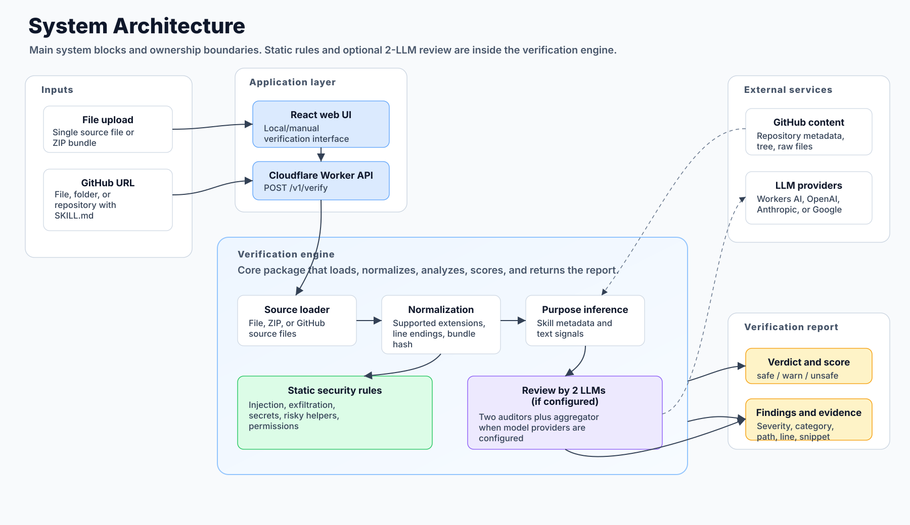

# AI Skills Verification

Open-source AI skill verification engine for checking AI agent skills and `SKILL.md` bundles before they are installed in Claude Code, Codex, Cursor, Windsurf, or an internal agent runtime.

This repository contains the core verification logic extracted from [SafeSkillMD, an AI skill verification and SKILL.md security scanner](https://safeskillmd.com/). It checks skill files and bundles for prompt injection, data exfiltration, secret access, risky helpers, hidden instructions, and excessive permissions before developers, AI adopters, and security reviewers add them to an agent environment.

The engine includes static rules and the optional two-auditor LLM consensus flow used by the hosted SafeSkillMD service.

## What Is AI Skill Verification?

AI skill verification is a security review of the files, instructions, permissions, and helper code that make up an AI agent skill. A skill is not just documentation: it can tell an agent what tools to use, where to read files, which shell commands to run, and how to transform user data.

That means a third-party skill can behave like a small supply-chain dependency. Before installing one, it is worth checking whether the skill tries to:

- Override the user's intent with prompt injection.
- Read secrets, SSH keys, cloud credentials, browser cookies, or local configuration.
- Exfiltrate user, project, or repository data through URLs, webhooks, beacons, or templated requests.
- Load or execute risky helper scripts.
- Request broader filesystem or tool permissions than its purpose requires.

## Why Scan SKILL.md Files?

`SKILL.md` files are becoming a common way to package behavior for AI coding assistants and agent tools. They can be shared through GitHub, copied from blog posts, generated by AI, or passed around inside teams. Many users installing these skills are not security specialists, and increasingly they are not traditional software engineers either.

This project gives teams a repeatable way to audit AI skills before trusting them. It is useful for:

- Developers reviewing third-party agent skills before installation.
- AI adopters who use Claude, Codex, Cursor, or Windsurf but do not want to manually audit every instruction file.
- Security teams building AI agent supply-chain checks into internal workflows.
- Tool builders who want an embeddable AI skill security scanner.
- Maintainers who want to test their own skills against common malicious patterns.

## Hosted Scanner

If you want to check a skill without running the engine locally, use the hosted scanner:

[Verify an AI skill with SafeSkillMD](https://safeskillmd.com/)

The hosted service supports uploaded files, ZIP bundles, and public GitHub URLs. It returns a score, a verdict, and findings with severity, category, file path, and line references.

## System Architecture



## What Is Included

```
.
├── apps/
│   ├── api/       # Minimal Cloudflare Worker API: POST /v1/verify
│   └── web/       # Minimal React UI for local/manual verification
├── packages/
│   ├── rules/     # Static rule engine
│   └── engine/    # Bundle loading, static rules, LLM consensus, scoring, purpose inference
└── examples/      # Clean and malicious sample skills
```

## Supported Inputs

- Single source files: `.md`, `.mdx`, `.txt`, `.yml`, `.yaml`, `.json`, `.toml`, `.py`, `.js`, `.ts`, `.tsx`, `.jsx`, `.sh`, `.rb`, `.go`, `.rs`
- ZIP bundles containing supported source files
- GitHub file URLs
- GitHub folder URLs
- GitHub repository URLs that contain one or more `SKILL.md` files

Unsupported/binary files are ignored during normalization.

## Verification Pipeline

1. Load source files from upload, ZIP, or GitHub.
2. Normalize text and compute a content hash.
3. Parse skill metadata from `SKILL.md` or the primary Markdown file.
4. Run static rules over the bundle.
5. Infer skill purpose from frontmatter and text signals.
6. If configured, run two LLM auditors in parallel.
7. Aggregate auditor outputs with the cheaper auditor model.
8. Score findings into `safe`, `warn`, or `unsafe`.

Static-only verification works without API keys. Full LLM consensus works with Cloudflare Workers AI, or with external OpenAI, Anthropic, or Google API keys. If more than one external key is configured, the engine selects the cheapest external model as the second auditor. Aggregation uses the cheaper of the two auditor models.

## Local Cloudflare Dependency

The local API runs through Wrangler. The Worker code and web assets run on your machine, but the default `AI` binding is a real Cloudflare Workers AI binding:

```text
browser -> localhost:5173 web UI -> localhost:8787 local Worker -> Cloudflare Workers AI
```

That means full LLM consensus requires a Cloudflare account authenticated with Wrangler, and Workers AI calls may use real Cloudflare resources. Check the active account with:

```bash
npx wrangler whoami
```

If you do not want to use Cloudflare Workers AI, remove or comment out the `[ai]` binding in `apps/api/wrangler.toml` and configure two external providers with secrets instead, or call the engine directly without `llm` options for static-only verification.

## Threat Categories

The current rules and auditors focus on practical AI agent skill risks:

- **Prompt injection:** hidden instructions, role tricks, encoded payloads, and instructions that try to override the user or host agent.
- **Data exfiltration:** suspicious URLs, webhooks, tracking beacons, long query strings, templated outbound requests, and instructions to forward private context.
- **Secret access:** references to environment variables, tokens, SSH keys, cloud credentials, browser cookies, and local credential stores.
- **Risky helpers:** shell execution, network-loaded scripts, destructive commands, or helper code that deserves manual review.
- **Excessive permissions:** broad tool declarations, wide filesystem globs, or permission combinations that exceed the skill's apparent purpose.

## Quick Start

```bash
pnpm install
pnpm test
pnpm typecheck
```

Run the smoke example:

```bash
pnpm exec tsx examples/smoke.mjs
```

Run the local API:

```bash
cp apps/api/wrangler.example.toml apps/api/wrangler.toml
pnpm dev:api
```

The included Wrangler config enables Cloudflare Workers AI by default:

```toml
[ai]
binding = "AI"
```

This is required for the default LLM consensus path. It is not required for static-only engine usage.

Optional external providers can be configured as Worker secrets:

```bash
wrangler secret put OPENAI_API_KEY
wrangler secret put ANTHROPIC_API_KEY
wrangler secret put GOOGLE_API_KEY
```

Optional model overrides are exposed as environment variables:

```toml
OPENAI_TEXT_MODEL = "gpt-5.4-nano"
ANTHROPIC_TEXT_MODEL = "claude-haiku-4-5-20251001"
GOOGLE_TEXT_MODEL = "gemini-3.1-flash-lite"
```

Run the web UI:

```bash
pnpm dev
```

The web UI runs on `http://localhost:5173` and proxies `/v1` requests to the Worker dev server on `http://127.0.0.1:8787`.

## API

### Verify A File Or ZIP

```bash
curl -sS -X POST http://127.0.0.1:8787/v1/verify \
  -F "file=@examples/mal-lipost.md"
```

### Verify A GitHub URL

```bash
curl -sS -X POST http://127.0.0.1:8787/v1/verify \
  -H "Content-Type: application/json" \
  -d '{"githubUrl":"https://github.com/owner/repo/tree/main/path/to/skill"}'
```

### Health

```bash
GET /healthz
GET /readyz
```

## Engine Usage

```ts
import { verifySkillSource } from '@aiskillsverification/engine';

const encoder = new TextEncoder();
const report = await verifySkillSource(
  [{ path: 'SKILL.md', bytes: encoder.encode(markdown) }],
  { sourceType: 'file', sourceRef: 'SKILL.md' },
  {
    llm: {
      workersAi: env.AI,
      openaiApiKey: env.OPENAI_API_KEY,
      anthropicApiKey: env.ANTHROPIC_API_KEY,
      googleApiKey: env.GOOGLE_API_KEY,
    },
  },
);

console.log(report.score, report.verdict, report.findings);
```

## Examples of reports:


## License

Apache-2.0
